<v-click>

## Supercharging Developer Workflow with

# Amazon Q Developer

  
    Vikash Agrawal
   
  <a href="https://linkedin.com/in/ivikash" target="_blank" alt="Connect with Vikash Agrawal on LinkedIn" title="Connect with Vikash Agrawal on LinkedIn"
      class="" style="border: none;">
      <carbon-logo-linkedin /> ivikash
  </a>

</v-click>

<!--

<ul>
  <li> Welcome to the talk, Supercharging developer workflow with Amazon Q Developer. </li>
  <li>In this talk, I want to focus on the supercharging, and before we do that, a quick health check
</ul>
-->

---

# quick show of hands
<v-click>

<ul v-click>
  <li v-click="1"> Do you write code?</li> 
  <li v-click="2"> Do you start from IDE & Terminal and deploy on Cloud?</li> 
  <li v-click="3"> Do you often search solutions online or use GenAI products?</li> 
</ul>

</v-click>

✅

<!-- 
<ul>
  <li>A quick show of hands</li>
</ul>
 -->

---

# mental modal

```mermaid
mindmap
  root((🧑‍💻👩‍💻))
    IDE
      Writing Code
        New Codebase
          Unfamiliarity with structure
          Learning curve
        Debugging
        Version Control
      Planning
        Lack of clear requirements
        Estimating time accurately
      Documentation
        Outdated or missing docs
        Understanding existing code
    Terminal
      Running Tests
        Test coverage gaps
      Building Project
        Dependency issues
      Local Environment Setup
        Configuration discrepancies
    Cloud Deployment
      CI/CD Pipeline
        Integration failures
      Infrastructure as Code
        Misconfigurations
      Monitoring and Logging
        Identifying production issues
    Common Challenges
      First Steps
        Where to begin?
        Setting up development environment
      Communication
        Collaborating with team members
        Understanding project goals
      Performance Optimization
        Identifying bottlenecks
        Scalability concerns
```

<v-clicks>

</v-clicks>
<!-- 
<ul>
  <li>Birds Eye View</li>
  <li>Lack of documentation</li>
  <li>Debugging Errors</li>
  <li>One thing thats missing here is reviewing code from GenAI products</li>
</ul>
-->

---

# software development life cycle (SDLC)

  <svg
    version="1.1"
    xmlns="http://www.w3.org/2000/svg"
    viewBox="0 0 374.13629776978917 405.8367599630609"
    width="374.13629776978917"
    height="405.8367599630609"
  >
    <defs>
      
    </defs>
    <rect
      x="0"
      y="0"
      width="374.13629776978917"
      height="405.8367599630609"
      fill="transparent"
    ></rect>
    <g
      v-click="1"
      stroke-linecap="round"
      transform="translate(146.8770723595967 10) rotate(0 37.45541702621614 33.19938044585795)"
    >
      <path
        d="M16.6 0 C28.02 0.84, 41.27 -0.56, 58.31 0 M16.6 0 C28.55 0.19, 39.92 0.57, 58.31 0 M58.31 0 C67.76 -0.46, 75.43 6.7, 74.91 16.6 M58.31 0 C67.72 1.33, 75.29 3.32, 74.91 16.6 M74.91 16.6 C74.81 24.83, 76.62 32.95, 74.91 49.8 M74.91 16.6 C76.09 25.78, 75.8 32.17, 74.91 49.8 M74.91 49.8 C76.01 61.45, 68.02 67.85, 58.31 66.4 M74.91 49.8 C73.99 60.26, 71.09 64.85, 58.31 66.4 M58.31 66.4 C42.88 64.44, 28.96 66.22, 16.6 66.4 M58.31 66.4 C46.48 66.67, 32.6 67, 16.6 66.4 M16.6 66.4 C4.3 64.53, 1.93 60.56, 0 49.8 M16.6 66.4 C7.17 65.39, 0.19 62.58, 0 49.8 M0 49.8 C-1.41 37.82, 0.07 30.31, 0 16.6 M0 49.8 C0.45 42.16, 0.61 34.81, 0 16.6 M0 16.6 C1.75 6.03, 4.75 1.79, 16.6 0 M0 16.6 C1.14 3.33, 7.24 1.44, 16.6 0"
        stroke="#00ffff"
        stroke-width="2"
        fill="none"
      ></path>
    </g>
    <g
      transform="translate(170.54000128766825 27.861963648593736) rotate(0 13.792488098144531 15.337416797264208)"
      v-click="1"
    >
      <text
        x="13.792488098144531"
        y="10.736191758084948"
        font-family="Comic Shanns, Segoe UI Emoji"
        font-size="12.26993343781137px"
        fill="#00ffff"
        text-anchor="middle"
        style="white-space: pre"
        direction="ltr"
        dominant-baseline="alphabetic"
      >
        📝
      </text>
      <text
        x="13.792488098144531"
        y="26.07360855534916"
        font-family="Comic Shanns, Segoe UI Emoji"
        font-size="12.26993343781137px"
        fill="#00ffff"
        text-anchor="middle"
        style="white-space: pre"
        direction="ltr"
        dominant-baseline="alphabetic"
      >
        Plan
      </text>
    </g>
    <g
      stroke-linecap="round"
      transform="translate(287.2348745929194 102.19285961644414) rotate(0 37.45541702621614 33.28806459948811)"
      v-click="2"
    >
      <path
        d="M16.64 0 C29.57 1.65, 42.74 1.06, 58.27 0 M16.64 0 C28.38 0.25, 38.99 1.29, 58.27 0 M58.27 0 C70.48 0.87, 73.41 6.21, 74.91 16.64 M58.27 0 C68.34 -0.23, 75.16 6.42, 74.91 16.64 M74.91 16.64 C73.73 24.9, 73.79 32.85, 74.91 49.93 M74.91 16.64 C75.65 26.17, 75.41 34.76, 74.91 49.93 M74.91 49.93 C72.94 63, 71.19 66.41, 58.27 66.58 M74.91 49.93 C72.93 63.31, 71.27 66.78, 58.27 66.58 M58.27 66.58 C43.44 66.4, 27.24 65.07, 16.64 66.58 M58.27 66.58 C44.29 66.94, 31.46 65.79, 16.64 66.58 M16.64 66.58 C6.2 65.92, -0.66 62.33, 0 49.93 M16.64 66.58 C7.5 67.73, 0.35 60.06, 0 49.93 M0 49.93 C-0.99 38.31, 0.9 25.15, 0 16.64 M0 49.93 C-0.67 42.28, 0.15 36.96, 0 16.64 M0 16.64 C1.91 5.23, 5.13 -1.83, 16.64 0 M0 16.64 C2.26 4.32, 4.68 1.52, 16.64 0"
        stroke="#ff1a1a"
        stroke-width="2"
        fill="none"
      ></path>
    </g>
    <g
      transform="translate(304.4551715163724 120.14350741866804) rotate(0 20.235120102763176 15.337416797264211)"
      v-click="2"
    >
      <text
        x="20.235120102763176"
        y="10.736191758084948"
        font-family="Comic Shanns, Segoe UI Emoji"
        font-size="12.26993343781137px"
        fill="#ff1a1a"
        text-anchor="middle"
        style="white-space: pre"
        direction="ltr"
        dominant-baseline="alphabetic"
      >
        🛠️
      </text>
      <text
        x="20.235120102763176"
        y="26.07360855534916"
        font-family="Comic Shanns, Segoe UI Emoji"
        font-size="12.26993343781137px"
        fill="#ff1a1a"
        text-anchor="middle"
        style="white-space: pre"
        direction="ltr"
        dominant-baseline="alphabetic"
      >
        Create
      </text>
    </g>
    <g
      stroke-linecap="round"
      transform="translate(287.2348745929194 281.9769461222352) rotate(0 37.45541702621614 33.28806459948811)"
      v-click="3"
    >
      <path
        d="M16.64 0 C26.38 -0.52, 34.21 0.41, 58.27 0 M16.64 0 C29.21 0.84, 40.37 0.52, 58.27 0 M58.27 0 C69.29 1.15, 73.71 6.44, 74.91 16.64 M58.27 0 C70.7 -1.23, 74.87 7.36, 74.91 16.64 M74.91 16.64 C75.17 28.33, 73.84 41.83, 74.91 49.93 M74.91 16.64 C74.08 25.41, 74.77 36.75, 74.91 49.93 M74.91 49.93 C75.58 60.2, 71.01 68.31, 58.27 66.58 M74.91 49.93 C76.48 62.84, 68.88 68.24, 58.27 66.58 M58.27 66.58 C45.55 64.99, 36.34 66.76, 16.64 66.58 M58.27 66.58 C46.77 67.45, 35.84 66.94, 16.64 66.58 M16.64 66.58 C4.32 65.66, 0.03 59.12, 0 49.93 M16.64 66.58 C4.14 65.33, 1.07 59.25, 0 49.93 M0 49.93 C0.72 42.53, -0.36 32.76, 0 16.64 M0 49.93 C-0.97 42.57, -0.35 34.92, 0 16.64 M0 16.64 C-1.68 5.08, 6.49 0.7, 16.64 0 M0 16.64 C2.05 3.65, 3.46 -0.87, 16.64 0"
        stroke="#00ff00"
        stroke-width="2"
        fill="none"
      ></path>
    </g>
    <g
      transform="translate(304.4613029716746 292.25888552582694) rotate(0 20.228988647460938 23.006125195896317)"
      v-click="3"
    >
      <text
        x="20.228988647460938"
        y="10.736191758084948"
        font-family="Comic Shanns, Segoe UI Emoji"
        font-size="12.26993343781137px"
        fill="#00ff00"
        text-anchor="middle"
        style="white-space: pre"
        direction="ltr"
        dominant-baseline="alphabetic"
      >
        🧪🔒
      </text>
      <text
        x="20.228988647460938"
        y="26.07360855534916"
        font-family="Comic Shanns, Segoe UI Emoji"
        font-size="12.26993343781137px"
        fill="#00ff00"
        text-anchor="middle"
        style="white-space: pre"
        direction="ltr"
        dominant-baseline="alphabetic"
      >
        Test &amp;
      </text>
      <text
        x="20.228988647460938"
        y="41.41102535261337"
        font-family="Comic Shanns, Segoe UI Emoji"
        font-size="12.26993343781137px"
        fill="#00ff00"
        text-anchor="middle"
        style="white-space: pre"
        direction="ltr"
        dominant-baseline="alphabetic"
      >
        Secure
      </text>
    </g>
    <g
      stroke-linecap="round"
      transform="translate(10 281.9769461222352) rotate(0 37.45541702621614 33.28806459948811)"
      v-click="4"
    >
      <path
        d="M16.64 0 C28.6 1.69, 39.44 -2, 58.27 0 M16.64 0 C31.22 -0.91, 44.75 -1.27, 58.27 0 M58.27 0 C68.45 0.83, 75.26 4.91, 74.91 16.64 M58.27 0 C71.29 0.1, 73.31 7.43, 74.91 16.64 M74.91 16.64 C73.9 23.92, 76.15 35.77, 74.91 49.93 M74.91 16.64 C76.1 24.47, 75.54 32.32, 74.91 49.93 M74.91 49.93 C75.86 62.1, 68.66 67.41, 58.27 66.58 M74.91 49.93 C74.72 60.56, 70.82 67.77, 58.27 66.58 M58.27 66.58 C49.78 66.12, 40.83 65.41, 16.64 66.58 M58.27 66.58 C47.7 67.29, 35.65 66.21, 16.64 66.58 M16.64 66.58 C4.57 68.37, 0.69 62.83, 0 49.93 M16.64 66.58 C5.35 68.74, 2.25 58.83, 0 49.93 M0 49.93 C-1.98 36.94, 0.26 24.61, 0 16.64 M0 49.93 C-0.53 37.48, 0.59 25.45, 0 16.64 M0 16.64 C0.88 7.24, 6.98 0.14, 16.64 0 M0 16.64 C-1.84 3.75, 7.69 -1.91, 16.64 0"
        stroke="#ff9900"
        stroke-width="2"
        fill="none"
      ></path>
    </g>
    <g
      transform="translate(23.799758810931735 299.9275939244591) rotate(0 23.655658215284348 15.337416797264211)"
      v-click="4"
    >
      <text
        x="23.655658215284348"
        y="10.736191758084948"
        font-family="Comic Shanns, Segoe UI Emoji"
        font-size="12.26993343781137px"
        fill="#ff9900"
        text-anchor="middle"
        style="white-space: pre"
        direction="ltr"
        dominant-baseline="alphabetic"
      >
        ⚙️
      </text>
      <text
        x="23.655658215284348"
        y="26.07360855534916"
        font-family="Comic Shanns, Segoe UI Emoji"
        font-size="12.26993343781137px"
        fill="#ff9900"
        text-anchor="middle"
        style="white-space: pre"
        direction="ltr"
        dominant-baseline="alphabetic"
      >
        Operate
      </text>
    </g>
    <g
      stroke-linecap="round"
      transform="translate(10 98.89215843324541) rotate(0 37.45541702621614 36)"
      v-click="5"
    >
      <path
        d="M18 0 C25.42 -1.1, 36.81 0.12, 56.91 0 M18 0 C29.2 -0.15, 42.04 -0.39, 56.91 0 M56.91 0 C69.63 -0.19, 74.97 6.59, 74.91 18 M56.91 0 C70.11 1.47, 74.15 4.24, 74.91 18 M74.91 18 C75.09 28.44, 75.05 40.99, 74.91 54 M74.91 18 C75.8 31.38, 73.98 44.39, 74.91 54 M74.91 54 C72.98 64.42, 70.73 72.96, 56.91 72 M74.91 54 C73.24 65.64, 69.7 72.74, 56.91 72 M56.91 72 C42.89 70.91, 27.59 71.72, 18 72 M56.91 72 C47.21 73.21, 38.4 72.29, 18 72 M18 72 C4.34 73, -0.7 65.3, 0 54 M18 72 C5.54 70.26, 0.13 67.53, 0 54 M0 54 C1.37 42.86, 0.37 35.39, 0 18 M0 54 C-0.43 42.3, -0.23 32.47, 0 18 M0 18 C0.46 4.08, 7.39 -1.29, 18 0 M0 18 C1.79 5.71, 6.01 -2.27, 18 0"
        stroke="#FFEB3B"
        stroke-width="2"
        fill="none"
      ></path>
    </g>
    <g
      transform="translate(16.80543838852077 104.21732483871699) rotate(0 30.649978637695312 30.674833594528423)"
      v-click="5"
    >
      <text
        x="30.649978637695312"
        y="10.736191758084948"
        font-family="Comic Shanns, Segoe UI Emoji"
        font-size="12.26993343781137px"
        fill="#FFEB3B"
        text-anchor="middle"
        style="white-space: pre"
        direction="ltr"
        dominant-baseline="alphabetic"
      >
        🔧✨
      </text>
      <text
        x="30.649978637695312"
        y="26.07360855534916"
        font-family="Comic Shanns, Segoe UI Emoji"
        font-size="12.26993343781137px"
        fill="#FFEB3B"
        text-anchor="middle"
        style="white-space: pre"
        direction="ltr"
        dominant-baseline="alphabetic"
      >
        Maintain
      </text>
      <text
        x="30.649978637695312"
        y="41.41102535261337"
        font-family="Comic Shanns, Segoe UI Emoji"
        font-size="12.26993343781137px"
        fill="#FFEB3B"
        text-anchor="middle"
        style="white-space: pre"
        direction="ltr"
        dominant-baseline="alphabetic"
      >
        &amp;
      </text>
      <text
        x="30.649978637695312"
        y="56.74844214987758"
        font-family="Comic Shanns, Segoe UI Emoji"
        font-size="12.26993343781137px"
        fill="#FFEB3B"
        text-anchor="middle"
        style="white-space: pre"
        direction="ltr"
        dominant-baseline="alphabetic"
      >
        Modernize
      </text>
    </g>
    <g stroke-linecap="round" v-click="2">
      <g
        transform="translate(224.4888993806785 45.299709388268916) rotate(0 44.80794477605917 25.41644396041318)"
      >
        <path
          d="M0.81 -0.54 C9.64 2.92, 37.75 12.15, 52.71 20.68 C67.67 29.22, 84.46 45.59, 90.58 50.69 M-0.23 1.79 C8.57 4.92, 37.29 10.59, 52.39 18.95 C67.48 27.3, 84.12 46.93, 90.32 51.94"
          stroke="#2196f37d"
          stroke-width="2"
          fill="none"
        ></path>
      </g>
      <g
        transform="translate(224.4888993806785 45.299709388268916) rotate(0 44.80794477605917 25.41644396041318)"
      >
        <path
          d="M67.89 42.02 C73.22 46.61, 81.58 48.99, 90.32 51.94 M67.89 42.02 C74.74 43.85, 80.06 46.85, 90.32 51.94"
          stroke="#2196f37d"
          stroke-width="2"
          fill="none"
        ></path>
      </g>
      <g
        transform="translate(224.4888993806785 45.299709388268916) rotate(0 44.80794477605917 25.41644396041318)"
      >
        <path
          d="M79.51 29.93 C81.6 37.95, 86.73 43.69, 90.32 51.94 M79.51 29.93 C82.99 35.29, 84.96 41.78, 90.32 51.94"
          stroke="#2196f37d"
          stroke-width="2"
          fill="none"
        ></path>
      </g>
    </g>
    <mask></mask>
    <g stroke-linecap="round" v-click="3">
      <g
        transform="translate(357.78006665554824 169.76898881542036) rotate(0 -0.06471804844977669 52.806040369246944)"
      >
        <path
          d="M0.14 1.03 C1.15 11.13, 7.21 42.79, 6.25 60.37 C5.29 77.95, -3.65 99.04, -5.62 106.5 M-1.25 0.52 C-0.33 10.3, 6.74 41.32, 5.86 58.67 C4.98 76.02, -4.66 96.74, -6.54 104.62"
          stroke="#2196f37d"
          stroke-width="2"
          fill="none"
        ></path>
      </g>
      <g
        transform="translate(357.78006665554824 169.76898881542036) rotate(0 -0.06471804844977669 52.806040369246944)"
      >
        <path
          d="M-7.25 81.01 C-5.36 90.27, -5.5 95.52, -6.54 104.62 M-7.25 81.01 C-7.61 90.55, -5.79 98.17, -6.54 104.62"
          stroke="#2196f37d"
          stroke-width="2"
          fill="none"
        ></path>
      </g>
      <g
        transform="translate(357.78006665554824 169.76898881542036) rotate(0 -0.06471804844977669 52.806040369246944)"
      >
        <path
          d="M8.09 86.08 C5.12 93.74, 0.11 97.39, -6.54 104.62 M8.09 86.08 C2 93.66, -1.91 99.38, -6.54 104.62"
          stroke="#2196f37d"
          stroke-width="2"
          fill="none"
        ></path>
      </g>
    </g>
    <mask></mask>
    <g stroke-linecap="round" v-click="5">
      <g
        transform="translate(29.406423818119265 280.1604693685217) rotate(0 -5.042203727842207 -52.176973271987634)"
      >
        <path
          d="M0.4 1.12 C-1.2 -8, -9.25 -37.49, -10.03 -54.98 C-10.81 -72.46, -5.25 -95.78, -4.28 -103.82 M-0.85 0.66 C-2.57 -8.79, -10.78 -39.04, -10.94 -56.8 C-11.11 -74.55, -2.94 -97.82, -1.84 -105.88"
          stroke="#2196f37d"
          stroke-width="2"
          fill="none"
        ></path>
      </g>
      <g
        transform="translate(29.406423818119265 280.1604693685217) rotate(0 -5.042203727842207 -52.176973271987634)"
      >
        <path
          d="M1.19 -81.44 C2.3 -87.84, 0.59 -95.89, -1.84 -105.88 M1.19 -81.44 C-0.41 -90.09, -0.87 -97.38, -1.84 -105.88"
          stroke="#2196f37d"
          stroke-width="2"
          fill="none"
        ></path>
      </g>
      <g
        transform="translate(29.406423818119265 280.1604693685217) rotate(0 -5.042203727842207 -52.176973271987634)"
      >
        <path
          d="M-15.23 -85.21 C-9.76 -90.66, -7.1 -97.71, -1.84 -105.88 M-15.23 -85.21 C-11.19 -92.72, -5.99 -98.7, -1.84 -105.88"
          stroke="#2196f37d"
          stroke-width="2"
          fill="none"
        ></path>
      </g>
    </g>
    <mask></mask>
    <g stroke-linecap="round"  v-click="6">
      <g
        transform="translate(69.37313913671915 95.30650393245989) rotate(0 35.46207475044298 -24.019261436927607)"
      >
        <path
          d="M0.49 -0.34 C6.22 -5.12, 21.8 -22, 33.54 -29.83 C45.27 -37.66, 64.6 -44.38, 70.89 -47.34 M-0.72 -1.56 C4.96 -6.06, 20.95 -20.44, 32.75 -28.4 C44.56 -36.36, 63.61 -46.35, 70.1 -49.31"
          stroke="#2196f37d"
          stroke-width="2"
          fill="none"
        ></path>
      </g>
      <g
        transform="translate(69.37313913671915 95.30650393245989) rotate(0 35.46207475044298 -24.019261436927607)"
      >
        <path
          d="M55.64 -34.11 C58.54 -37.14, 62.07 -41.21, 70.1 -49.31 M55.64 -34.11 C59.92 -38.86, 66.35 -45.9, 70.1 -49.31"
          stroke="#2196f37d"
          stroke-width="2"
          fill="none"
        ></path>
      </g>
      <g
        transform="translate(69.37313913671915 95.30650393245989) rotate(0 35.46207475044298 -24.019261436927607)"
      >
        <path
          d="M49.25 -46.97 C53.5 -47.07, 58.49 -48.19, 70.1 -49.31 M49.25 -46.97 C55.86 -47.13, 64.58 -49.56, 70.1 -49.31"
          stroke="#2196f37d"
          stroke-width="2"
          fill="none"
        ></path>
      </g>
    </g>
    <mask></mask>
    <g stroke-linecap="round" v-click="4">
      <g
        transform="translate(305.6665017367692 349.8574292625634) rotate(0 -114.20384278073317 22.40354565074111)"
      >
        <path
          d="M-1.12 -0.53 C-9.04 4.39, -28.11 22.95, -47.95 30.49 C-67.78 38.03, -96.72 44.92, -120.14 44.71 C-143.55 44.5, -170.5 35.91, -188.45 29.21 C-206.39 22.52, -221.08 9.02, -227.81 4.54 M0.49 1.81 C-7.48 6.77, -28.18 24.18, -48.46 31.54 C-68.74 38.9, -97.81 46.15, -121.18 45.98 C-144.55 45.8, -170.74 37.84, -188.7 30.48 C-206.67 23.12, -222.48 6.17, -228.97 1.81"
          stroke="#2196f37d"
          stroke-width="2"
          fill="none"
        ></path>
      </g>
      <g
        transform="translate(305.6665017367692 349.8574292625634) rotate(0 -114.20384278073317 22.40354565074111)"
      >
        <path
          d="M-206.26 9.83 C-213.21 8.88, -219.89 4.5, -228.97 1.81 M-206.26 9.83 C-212.33 8.4, -219.82 4.21, -228.97 1.81"
          stroke="#2196f37d"
          stroke-width="2"
          fill="none"
        ></path>
      </g>
      <g
        transform="translate(305.6665017367692 349.8574292625634) rotate(0 -114.20384278073317 22.40354565074111)"
      >
        <path
          d="M-216.74 22.55 C-221.02 18.33, -224.93 10.6, -228.97 1.81 M-216.74 22.55 C-219.65 17.38, -224.08 9.48, -228.97 1.81"
          stroke="#2196f37d"
          stroke-width="2"
          fill="none"
        ></path>
      </g>
    </g>
    <mask></mask>
    <g
      transform="translate(139.65101770317824 166.02948200484255) rotate(0 48.128539715279544 48.12853971527953)"
    >
      <use
        href="#image-dcff71ec6682a8fcbfdf2f453d7fba349708bb2f"
        width="96"
        height="96"
        opacity="1"
      ></use>
    </g>
    <symbol id="image-dcff71ec6682a8fcbfdf2f453d7fba349708bb2f" v-click="7">
        <image
          width="100%"
          height="100%"
          href="data:image/svg+xml;base64,PHN2ZyB4bWxucz0iaHR0cDovL3d3dy53My5vcmcvMjAwMC9zdmciIHdpZHRoPSIxMjgiIGhlaWdodD0iMTI4IiB2aWV3Qm94PSIwIDAgMTI4IDEyOCIgZmlsbD0ibm9uZSI+CjxnIGNsaXAtcGF0aD0idXJsKCNjbGlwMF8xODQ1XzY4KSI+CjxwYXRoIGQ9Ik01NC4xNyAyLjYzTDE1Ljc3IDI0LjhDOS42OSAyOC4zMSA1Ljk0IDM0LjggNS45NCA0MS44M1Y4Ni4xN0M1Ljk0IDkzLjIgOS42OSA5OS42OSAxNS43NyAxMDMuMkw1NC4xNyAxMjUuMzdDNjAuMjUgMTI4Ljg4IDY3Ljc1IDEyOC44OCA3My44MyAxMjUuMzdMMTEyLjIzIDEwMy4yQzExOC4zMSA5OS42OSAxMjIuMDYgOTMuMiAxMjIuMDYgODYuMTdWNDEuODNDMTIyLjA2IDM0LjgxIDExOC4zMSAyOC4zMSAxMTIuMjMgMjQuOEw3My44MyAyLjYzQzY3Ljc1IC0wLjg4MDAwMiA2MC4yNSAtMC44ODAwMDIgNTQuMTcgMi42M1oiIGZpbGw9InVybCgjcGFpbnQwX2xpbmVhcl8xODQ1XzY4KSIvPgo8cGF0aCBkPSJNMTAwLjk4IDM1LjE1TDcwLjQ5IDE3LjU1QzY4LjcgMTYuNTIgNjYuMzUgMTYgNjMuOTkgMTZDNjEuNjMgMTYgNTkuMjggMTYuNTIgNTcuNDkgMTcuNTVMMjcgMzUuMTVDMjMuNDMgMzcuMjEgMjAuNSA0Mi4yOCAyMC41IDQ2LjRWODEuNkMyMC41IDg1LjczIDIzLjQyIDkwLjc5IDI3IDkyLjg1TDU3LjQ5IDExMC40NUM1OS4yOCAxMTEuNDggNjEuNjMgMTEyIDYzLjk5IDExMkM2Ni4zNSAxMTIgNjguNyAxMTEuNDggNzAuNDkgMTEwLjQ1TDEwMC45OCA5Mi44NUMxMDQuNTUgOTAuNzkgMTA3LjQ4IDg1LjcyIDEwNy40OCA4MS42VjQ2LjRDMTA3LjQ4IDQyLjI3IDEwNC41NiAzNy4yMSAxMDAuOTggMzUuMTVaTTY2LjQ5IDEwMy41M0M2Ni4yMSAxMDMuNjkgNjUuMzIgMTA0LjAxIDYzLjk5IDEwNC4wMUM2Mi42NiAxMDQuMDEgNjEuNzggMTAzLjcgNjEuNDkgMTAzLjUzTDMxIDg1LjkzQzI5LjkgODUuMyAyOC41IDgyLjg3IDI4LjUgODEuNjFWNDYuNDFDMjguNSA0NS4xNCAyOS45IDQyLjcyIDMxIDQyLjA5TDYxLjQ5IDI0LjQ5QzYxLjc3IDI0LjMzIDYyLjY2IDI0LjAxIDYzLjk5IDI0LjAxQzY1LjMyIDI0LjAxIDY2LjIgMjQuMzIgNjYuNDkgMjQuNDlMOTYuOTggNDIuMDlDOTguMDggNDIuNzIgOTkuNDggNDUuMTUgOTkuNDggNDYuNDFWNzkuODhMNzIgNjQuMDJWNjAuNzNDNzIgNTkuOTEgNzEuNTYgNTkuMTUgNzAuODUgNTguNzNMNjUuMTUgNTUuNDRDNjQuNzkgNTUuMjMgNjQuNCA1NS4xMyA2NCA1NS4xM0M2My42IDU1LjEzIDYzLjIgNTUuMjMgNjIuODUgNTUuNDRMNTcuMTUgNTguNzNDNTYuNDQgNTkuMTQgNTYgNTkuOSA1NiA2MC43M1Y2Ny4zMUM1NiA2OC4xMyA1Ni40NCA2OC44OSA1Ny4xNSA2OS4zMUw2Mi44NSA3Mi42QzYzLjIxIDcyLjgxIDYzLjYgNzIuOTEgNjQgNzIuOTFDNjQuNCA3Mi45MSA2NC44IDcyLjgxIDY1LjE1IDcyLjZMNjggNzAuOTZMOTUuNDggODYuODJMNjYuNSAxMDMuNTVMNjYuNDkgMTAzLjUzWiIgZmlsbD0id2hpdGUiLz4KPC9nPgo8ZGVmcz4KPGxpbmVhckdyYWRpZW50IGlkPSJwYWludDBfbGluZWFyXzE4NDVfNjgiIHgxPSIxMTUuNTIiIHkxPSItOS41NzAwMSIgeDI9IjE4Ljg2IiB5Mj0iMTI4LjQ2IiBncmFkaWVudFVuaXRzPSJ1c2VyU3BhY2VPblVzZSI+CjxzdG9wIHN0b3AtY29sb3I9IiNBN0Y4RkYiLz4KPHN0b3Agb2Zmc2V0PSIwLjAzIiBzdG9wLWNvbG9yPSIjOURGMUZGIi8+CjxzdG9wIG9mZnNldD0iMC4wOCIgc3RvcC1jb2xvcj0iIzg0RTFGRiIvPgo8c3RvcCBvZmZzZXQ9IjAuMTUiIHN0b3AtY29sb3I9IiM1QUM3RkYiLz4KPHN0b3Agb2Zmc2V0PSIwLjIyIiBzdG9wLWNvbG9yPSIjMjFBMkZGIi8+CjxzdG9wIG9mZnNldD0iMC4yNiIgc3RvcC1jb2xvcj0iIzAwOERGRiIvPgo8c3RvcCBvZmZzZXQ9IjAuNjYiIHN0b3AtY29sb3I9IiM3RjMzRkYiLz4KPHN0b3Agb2Zmc2V0PSIwLjk5IiBzdG9wLWNvbG9yPSIjMzkxMjdEIi8+CjwvbGluZWFyR3JhZGllbnQ+CjxjbGlwUGF0aCBpZD0iY2xpcDBfMTg0NV82OCI+CjxyZWN0IHdpZHRoPSIxMjgiIGhlaWdodD0iMTI4IiBmaWxsPSJ3aGl0ZSIvPgo8L2NsaXBQYXRoPgo8L2RlZnM+Cjwvc3ZnPg=="
          preserveAspectRatio="none"
        ></image>
      </symbol>
  </svg>

<!-- 
<ul>
  <li></li>
  <li></li>
  <li></li>
</ul>
-->

---

# what is Amazon Q Developer?

<v-click>

Amazon Q Developer is a generative artificial intelligence (AI) powered conversational assistant that can help you  understand, build, extend, and operate AWS applications. You can ask questions about AWS architecture, your AWS resources, best practices, documentation, support, and more.

</v-click>

---

# where can you find Amazon Q Developer?

<v-clicks>

- 💻 IDEs
- 🖥️ Terminal
- 🌐 AWS Management Console (Web & Mobile)
- 📖 AWS Documentation
- 🤖 Slack and Teams (through AWS Chatbot)

</v-clicks>

---

<pre>
██████╗     ███████╗    ███╗   ███╗     ██████╗ 
██╔══██╗    ██╔════╝    ████╗ ████║    ██╔═══██╗
██║  ██║    █████╗      ██╔████╔██║    ██║   ██║
██║  ██║    ██╔══╝      ██║╚██╔╝██║    ██║   ██║
██████╔╝    ███████╗    ██║ ╚═╝ ██║    ╚██████╔╝
╚═════╝     ╚══════╝    ╚═╝     ╚═╝     ╚═════╝ 
</pre>

---

# `/dev` - Amazon Q Agent for Software Development

<iframe width="560" height="315" src="https://www.youtube.com/embed/dwahDpQllNI?si=QfO_XflZV2b_2stf" title="YouTube video player" frameborder="0" allow="accelerometer; autoplay; clipboard-write; encrypted-media; gyroscope; picture-in-picture; web-share" referrerpolicy="strict-origin-when-cross-origin" allowfullscreen></iframe>

---

# generate documentations with Amazon Q Developer

<iframe width="560" height="315" src="https://www.youtube.com/embed/mXXy006dVCQ?si=J3OWvwrFPI1GUdz-" title="YouTube video player" frameborder="0" allow="accelerometer; autoplay; clipboard-write; encrypted-media; gyroscope; picture-in-picture; web-share" referrerpolicy="strict-origin-when-cross-origin" allowfullscreen></iframe>

---

# q cli

<iframe width="560" height="315" src="https://www.youtube.com/embed/4I48iXNz6Kw?si=TQqlgZc-uHp2iN0C" title="YouTube video player" frameborder="0" allow="accelerometer; autoplay; clipboard-write; encrypted-media; gyroscope; picture-in-picture; web-share" referrerpolicy="strict-origin-when-cross-origin" allowfullscreen></iframe>

---

# Amazon Q Developer as a tutor

  <pre>
I want you to act as vimtutor for VSCode and Neovim.
I want you to teach me which is task based.
Do not move to next step, unless I say "done".
  </pre>

---

Thank You

---
layout: two-cols
---

QnA

::right::
<svg xmlns="http://www.w3.org/2000/svg" viewBox="0 0 1000 1000">
  <rect
    x="0"
    y="0"
    width="1000"
    height="1000"
    fill-opacity="0"
    fill="#ffffff"
  />
  <g fill="#4CAF50">
    <rect x="87" y="312" width="25" height="25" shape-rendering="crispEdges" />
    <rect x="87" y="337" width="25" height="25" shape-rendering="crispEdges" />
    <rect x="87" y="387" width="25" height="25" shape-rendering="crispEdges" />
    <rect x="87" y="412" width="25" height="25" shape-rendering="crispEdges" />
    <rect x="87" y="437" width="25" height="25" shape-rendering="crispEdges" />
    <rect x="87" y="487" width="25" height="25" shape-rendering="crispEdges" />
    <rect x="87" y="537" width="25" height="25" shape-rendering="crispEdges" />
    <rect x="87" y="562" width="25" height="25" shape-rendering="crispEdges" />
    <rect x="87" y="587" width="25" height="25" shape-rendering="crispEdges" />
    <rect x="87" y="612" width="25" height="25" shape-rendering="crispEdges" />
    <rect x="87" y="662" width="25" height="25" shape-rendering="crispEdges" />
    <rect x="112" y="287" width="25" height="25" shape-rendering="crispEdges" />
    <rect x="112" y="312" width="25" height="25" shape-rendering="crispEdges" />
    <rect x="112" y="362" width="25" height="25" shape-rendering="crispEdges" />
    <rect x="112" y="437" width="25" height="25" shape-rendering="crispEdges" />
    <rect x="112" y="462" width="25" height="25" shape-rendering="crispEdges" />
    <rect x="112" y="512" width="25" height="25" shape-rendering="crispEdges" />
    <rect x="112" y="662" width="25" height="25" shape-rendering="crispEdges" />
    <rect x="112" y="687" width="25" height="25" shape-rendering="crispEdges" />
    <rect x="137" y="287" width="25" height="25" shape-rendering="crispEdges" />
    <rect x="137" y="337" width="25" height="25" shape-rendering="crispEdges" />
    <rect x="137" y="412" width="25" height="25" shape-rendering="crispEdges" />
    <rect x="137" y="487" width="25" height="25" shape-rendering="crispEdges" />
    <rect x="137" y="537" width="25" height="25" shape-rendering="crispEdges" />
    <rect x="137" y="587" width="25" height="25" shape-rendering="crispEdges" />
    <rect x="162" y="362" width="25" height="25" shape-rendering="crispEdges" />
    <rect x="162" y="412" width="25" height="25" shape-rendering="crispEdges" />
    <rect x="162" y="437" width="25" height="25" shape-rendering="crispEdges" />
    <rect x="162" y="462" width="25" height="25" shape-rendering="crispEdges" />
    <rect x="162" y="537" width="25" height="25" shape-rendering="crispEdges" />
    <rect x="162" y="562" width="25" height="25" shape-rendering="crispEdges" />
    <rect x="162" y="612" width="25" height="25" shape-rendering="crispEdges" />
    <rect x="162" y="687" width="25" height="25" shape-rendering="crispEdges" />
    <rect x="187" y="312" width="25" height="25" shape-rendering="crispEdges" />
    <rect x="187" y="387" width="25" height="25" shape-rendering="crispEdges" />
    <rect x="187" y="462" width="25" height="25" shape-rendering="crispEdges" />
    <rect x="187" y="487" width="25" height="25" shape-rendering="crispEdges" />
    <rect x="187" y="537" width="25" height="25" shape-rendering="crispEdges" />
    <rect x="187" y="612" width="25" height="25" shape-rendering="crispEdges" />
    <rect x="187" y="637" width="25" height="25" shape-rendering="crispEdges" />
    <rect x="187" y="662" width="25" height="25" shape-rendering="crispEdges" />
    <rect x="187" y="687" width="25" height="25" shape-rendering="crispEdges" />
    <rect x="212" y="337" width="25" height="25" shape-rendering="crispEdges" />
    <rect x="212" y="412" width="25" height="25" shape-rendering="crispEdges" />
    <rect x="212" y="437" width="25" height="25" shape-rendering="crispEdges" />
    <rect x="212" y="462" width="25" height="25" shape-rendering="crispEdges" />
    <rect x="212" y="487" width="25" height="25" shape-rendering="crispEdges" />
    <rect x="212" y="537" width="25" height="25" shape-rendering="crispEdges" />
    <rect x="212" y="662" width="25" height="25" shape-rendering="crispEdges" />
    <rect x="237" y="287" width="25" height="25" shape-rendering="crispEdges" />
    <rect x="237" y="337" width="25" height="25" shape-rendering="crispEdges" />
    <rect x="237" y="387" width="25" height="25" shape-rendering="crispEdges" />
    <rect x="237" y="437" width="25" height="25" shape-rendering="crispEdges" />
    <rect x="237" y="487" width="25" height="25" shape-rendering="crispEdges" />
    <rect x="237" y="537" width="25" height="25" shape-rendering="crispEdges" />
    <rect x="237" y="587" width="25" height="25" shape-rendering="crispEdges" />
    <rect x="237" y="637" width="25" height="25" shape-rendering="crispEdges" />
    <rect x="237" y="687" width="25" height="25" shape-rendering="crispEdges" />
    <rect x="262" y="462" width="25" height="25" shape-rendering="crispEdges" />
    <rect x="262" y="512" width="25" height="25" shape-rendering="crispEdges" />
    <rect x="262" y="537" width="25" height="25" shape-rendering="crispEdges" />
    <rect x="262" y="562" width="25" height="25" shape-rendering="crispEdges" />
    <rect x="262" y="637" width="25" height="25" shape-rendering="crispEdges" />
    <rect x="262" y="687" width="25" height="25" shape-rendering="crispEdges" />
    <rect x="287" y="112" width="25" height="25" shape-rendering="crispEdges" />
    <rect x="287" y="137" width="25" height="25" shape-rendering="crispEdges" />
    <rect x="287" y="162" width="25" height="25" shape-rendering="crispEdges" />
    <rect x="287" y="212" width="25" height="25" shape-rendering="crispEdges" />
    <rect x="287" y="237" width="25" height="25" shape-rendering="crispEdges" />
    <rect x="287" y="312" width="25" height="25" shape-rendering="crispEdges" />
    <rect x="287" y="362" width="25" height="25" shape-rendering="crispEdges" />
    <rect x="287" y="387" width="25" height="25" shape-rendering="crispEdges" />
    <rect x="287" y="462" width="25" height="25" shape-rendering="crispEdges" />
    <rect x="287" y="512" width="25" height="25" shape-rendering="crispEdges" />
    <rect x="287" y="612" width="25" height="25" shape-rendering="crispEdges" />
    <rect x="287" y="662" width="25" height="25" shape-rendering="crispEdges" />
    <rect x="287" y="837" width="25" height="25" shape-rendering="crispEdges" />
    <rect x="287" y="862" width="25" height="25" shape-rendering="crispEdges" />
    <rect x="312" y="87" width="25" height="25" shape-rendering="crispEdges" />
    <rect x="312" y="112" width="25" height="25" shape-rendering="crispEdges" />
    <rect x="312" y="162" width="25" height="25" shape-rendering="crispEdges" />
    <rect x="312" y="187" width="25" height="25" shape-rendering="crispEdges" />
    <rect x="312" y="212" width="25" height="25" shape-rendering="crispEdges" />
    <rect x="312" y="262" width="25" height="25" shape-rendering="crispEdges" />
    <rect x="312" y="312" width="25" height="25" shape-rendering="crispEdges" />
    <rect x="312" y="337" width="25" height="25" shape-rendering="crispEdges" />
    <rect x="312" y="412" width="25" height="25" shape-rendering="crispEdges" />
    <rect x="312" y="437" width="25" height="25" shape-rendering="crispEdges" />
    <rect x="312" y="462" width="25" height="25" shape-rendering="crispEdges" />
    <rect x="312" y="487" width="25" height="25" shape-rendering="crispEdges" />
    <rect x="312" y="512" width="25" height="25" shape-rendering="crispEdges" />
    <rect x="312" y="537" width="25" height="25" shape-rendering="crispEdges" />
    <rect x="312" y="562" width="25" height="25" shape-rendering="crispEdges" />
    <rect x="312" y="587" width="25" height="25" shape-rendering="crispEdges" />
    <rect x="312" y="662" width="25" height="25" shape-rendering="crispEdges" />
    <rect x="312" y="737" width="25" height="25" shape-rendering="crispEdges" />
    <rect x="312" y="762" width="25" height="25" shape-rendering="crispEdges" />
    <rect x="312" y="812" width="25" height="25" shape-rendering="crispEdges" />
    <rect x="312" y="837" width="25" height="25" shape-rendering="crispEdges" />
    <rect x="312" y="887" width="25" height="25" shape-rendering="crispEdges" />
    <rect x="337" y="87" width="25" height="25" shape-rendering="crispEdges" />
    <rect x="337" y="137" width="25" height="25" shape-rendering="crispEdges" />
    <rect x="337" y="162" width="25" height="25" shape-rendering="crispEdges" />
    <rect x="337" y="212" width="25" height="25" shape-rendering="crispEdges" />
    <rect x="337" y="237" width="25" height="25" shape-rendering="crispEdges" />
    <rect x="337" y="287" width="25" height="25" shape-rendering="crispEdges" />
    <rect x="337" y="312" width="25" height="25" shape-rendering="crispEdges" />
    <rect x="337" y="387" width="25" height="25" shape-rendering="crispEdges" />
    <rect x="337" y="437" width="25" height="25" shape-rendering="crispEdges" />
    <rect x="337" y="537" width="25" height="25" shape-rendering="crispEdges" />
    <rect x="337" y="612" width="25" height="25" shape-rendering="crispEdges" />
    <rect x="337" y="637" width="25" height="25" shape-rendering="crispEdges" />
    <rect x="337" y="662" width="25" height="25" shape-rendering="crispEdges" />
    <rect x="337" y="712" width="25" height="25" shape-rendering="crispEdges" />
    <rect x="337" y="762" width="25" height="25" shape-rendering="crispEdges" />
    <rect x="337" y="787" width="25" height="25" shape-rendering="crispEdges" />
    <rect x="337" y="812" width="25" height="25" shape-rendering="crispEdges" />
    <rect x="337" y="862" width="25" height="25" shape-rendering="crispEdges" />
    <rect x="337" y="887" width="25" height="25" shape-rendering="crispEdges" />
    <rect x="362" y="87" width="25" height="25" shape-rendering="crispEdges" />
    <rect x="362" y="212" width="25" height="25" shape-rendering="crispEdges" />
    <rect x="362" y="262" width="25" height="25" shape-rendering="crispEdges" />
    <rect x="362" y="337" width="25" height="25" shape-rendering="crispEdges" />
    <rect x="362" y="362" width="25" height="25" shape-rendering="crispEdges" />
    <rect x="362" y="387" width="25" height="25" shape-rendering="crispEdges" />
    <rect x="362" y="437" width="25" height="25" shape-rendering="crispEdges" />
    <rect x="362" y="512" width="25" height="25" shape-rendering="crispEdges" />
    <rect x="362" y="612" width="25" height="25" shape-rendering="crispEdges" />
    <rect x="362" y="637" width="25" height="25" shape-rendering="crispEdges" />
    <rect x="362" y="662" width="25" height="25" shape-rendering="crispEdges" />
    <rect x="362" y="687" width="25" height="25" shape-rendering="crispEdges" />
    <rect x="362" y="737" width="25" height="25" shape-rendering="crispEdges" />
    <rect x="362" y="762" width="25" height="25" shape-rendering="crispEdges" />
    <rect x="362" y="812" width="25" height="25" shape-rendering="crispEdges" />
    <rect x="362" y="887" width="25" height="25" shape-rendering="crispEdges" />
    <rect x="387" y="112" width="25" height="25" shape-rendering="crispEdges" />
    <rect x="387" y="237" width="25" height="25" shape-rendering="crispEdges" />
    <rect x="387" y="287" width="25" height="25" shape-rendering="crispEdges" />
    <rect x="387" y="312" width="25" height="25" shape-rendering="crispEdges" />
    <rect x="387" y="362" width="25" height="25" shape-rendering="crispEdges" />
    <rect x="387" y="412" width="25" height="25" shape-rendering="crispEdges" />
    <rect x="387" y="437" width="25" height="25" shape-rendering="crispEdges" />
    <rect x="387" y="462" width="25" height="25" shape-rendering="crispEdges" />
    <rect x="387" y="587" width="25" height="25" shape-rendering="crispEdges" />
    <rect x="387" y="612" width="25" height="25" shape-rendering="crispEdges" />
    <rect x="387" y="637" width="25" height="25" shape-rendering="crispEdges" />
    <rect x="387" y="662" width="25" height="25" shape-rendering="crispEdges" />
    <rect x="387" y="687" width="25" height="25" shape-rendering="crispEdges" />
    <rect x="387" y="712" width="25" height="25" shape-rendering="crispEdges" />
    <rect x="387" y="762" width="25" height="25" shape-rendering="crispEdges" />
    <rect x="387" y="787" width="25" height="25" shape-rendering="crispEdges" />
    <rect x="387" y="812" width="25" height="25" shape-rendering="crispEdges" />
    <rect x="387" y="862" width="25" height="25" shape-rendering="crispEdges" />
    <rect x="387" y="887" width="25" height="25" shape-rendering="crispEdges" />
    <rect x="412" y="137" width="25" height="25" shape-rendering="crispEdges" />
    <rect x="412" y="162" width="25" height="25" shape-rendering="crispEdges" />
    <rect x="412" y="212" width="25" height="25" shape-rendering="crispEdges" />
    <rect x="412" y="362" width="25" height="25" shape-rendering="crispEdges" />
    <rect x="412" y="412" width="25" height="25" shape-rendering="crispEdges" />
    <rect x="412" y="462" width="25" height="25" shape-rendering="crispEdges" />
    <rect x="412" y="587" width="25" height="25" shape-rendering="crispEdges" />
    <rect x="412" y="662" width="25" height="25" shape-rendering="crispEdges" />
    <rect x="412" y="712" width="25" height="25" shape-rendering="crispEdges" />
    <rect x="412" y="762" width="25" height="25" shape-rendering="crispEdges" />
    <rect x="412" y="862" width="25" height="25" shape-rendering="crispEdges" />
    <rect x="437" y="112" width="25" height="25" shape-rendering="crispEdges" />
    <rect x="437" y="137" width="25" height="25" shape-rendering="crispEdges" />
    <rect x="437" y="162" width="25" height="25" shape-rendering="crispEdges" />
    <rect x="437" y="187" width="25" height="25" shape-rendering="crispEdges" />
    <rect x="437" y="237" width="25" height="25" shape-rendering="crispEdges" />
    <rect x="437" y="262" width="25" height="25" shape-rendering="crispEdges" />
    <rect x="437" y="287" width="25" height="25" shape-rendering="crispEdges" />
    <rect x="437" y="312" width="25" height="25" shape-rendering="crispEdges" />
    <rect x="437" y="362" width="25" height="25" shape-rendering="crispEdges" />
    <rect x="437" y="412" width="25" height="25" shape-rendering="crispEdges" />
    <rect x="437" y="462" width="25" height="25" shape-rendering="crispEdges" />
    <rect x="437" y="487" width="25" height="25" shape-rendering="crispEdges" />
    <rect x="437" y="512" width="25" height="25" shape-rendering="crispEdges" />
    <rect x="437" y="537" width="25" height="25" shape-rendering="crispEdges" />
    <rect x="437" y="562" width="25" height="25" shape-rendering="crispEdges" />
    <rect x="437" y="587" width="25" height="25" shape-rendering="crispEdges" />
    <rect x="437" y="637" width="25" height="25" shape-rendering="crispEdges" />
    <rect x="437" y="687" width="25" height="25" shape-rendering="crispEdges" />
    <rect x="437" y="737" width="25" height="25" shape-rendering="crispEdges" />
    <rect x="437" y="787" width="25" height="25" shape-rendering="crispEdges" />
    <rect x="462" y="112" width="25" height="25" shape-rendering="crispEdges" />
    <rect x="462" y="312" width="25" height="25" shape-rendering="crispEdges" />
    <rect x="462" y="337" width="25" height="25" shape-rendering="crispEdges" />
    <rect x="462" y="387" width="25" height="25" shape-rendering="crispEdges" />
    <rect x="462" y="437" width="25" height="25" shape-rendering="crispEdges" />
    <rect x="462" y="462" width="25" height="25" shape-rendering="crispEdges" />
    <rect x="462" y="487" width="25" height="25" shape-rendering="crispEdges" />
    <rect x="462" y="537" width="25" height="25" shape-rendering="crispEdges" />
    <rect x="462" y="612" width="25" height="25" shape-rendering="crispEdges" />
    <rect x="462" y="637" width="25" height="25" shape-rendering="crispEdges" />
    <rect x="462" y="662" width="25" height="25" shape-rendering="crispEdges" />
    <rect x="462" y="712" width="25" height="25" shape-rendering="crispEdges" />
    <rect x="462" y="737" width="25" height="25" shape-rendering="crispEdges" />
    <rect x="462" y="787" width="25" height="25" shape-rendering="crispEdges" />
    <rect x="462" y="812" width="25" height="25" shape-rendering="crispEdges" />
    <rect x="462" y="837" width="25" height="25" shape-rendering="crispEdges" />
    <rect x="487" y="87" width="25" height="25" shape-rendering="crispEdges" />
    <rect x="487" y="112" width="25" height="25" shape-rendering="crispEdges" />
    <rect x="487" y="137" width="25" height="25" shape-rendering="crispEdges" />
    <rect x="487" y="187" width="25" height="25" shape-rendering="crispEdges" />
    <rect x="487" y="212" width="25" height="25" shape-rendering="crispEdges" />
    <rect x="487" y="237" width="25" height="25" shape-rendering="crispEdges" />
    <rect x="487" y="262" width="25" height="25" shape-rendering="crispEdges" />
    <rect x="487" y="287" width="25" height="25" shape-rendering="crispEdges" />
    <rect x="487" y="337" width="25" height="25" shape-rendering="crispEdges" />
    <rect x="487" y="362" width="25" height="25" shape-rendering="crispEdges" />
    <rect x="487" y="412" width="25" height="25" shape-rendering="crispEdges" />
    <rect x="487" y="437" width="25" height="25" shape-rendering="crispEdges" />
    <rect x="487" y="462" width="25" height="25" shape-rendering="crispEdges" />
    <rect x="487" y="512" width="25" height="25" shape-rendering="crispEdges" />
    <rect x="487" y="537" width="25" height="25" shape-rendering="crispEdges" />
    <rect x="487" y="587" width="25" height="25" shape-rendering="crispEdges" />
    <rect x="487" y="612" width="25" height="25" shape-rendering="crispEdges" />
    <rect x="487" y="637" width="25" height="25" shape-rendering="crispEdges" />
    <rect x="487" y="712" width="25" height="25" shape-rendering="crispEdges" />
    <rect x="487" y="737" width="25" height="25" shape-rendering="crispEdges" />
    <rect x="487" y="787" width="25" height="25" shape-rendering="crispEdges" />
    <rect x="487" y="812" width="25" height="25" shape-rendering="crispEdges" />
    <rect x="487" y="837" width="25" height="25" shape-rendering="crispEdges" />
    <rect x="512" y="87" width="25" height="25" shape-rendering="crispEdges" />
    <rect x="512" y="112" width="25" height="25" shape-rendering="crispEdges" />
    <rect x="512" y="137" width="25" height="25" shape-rendering="crispEdges" />
    <rect x="512" y="162" width="25" height="25" shape-rendering="crispEdges" />
    <rect x="512" y="212" width="25" height="25" shape-rendering="crispEdges" />
    <rect x="512" y="312" width="25" height="25" shape-rendering="crispEdges" />
    <rect x="512" y="362" width="25" height="25" shape-rendering="crispEdges" />
    <rect x="512" y="412" width="25" height="25" shape-rendering="crispEdges" />
    <rect x="512" y="437" width="25" height="25" shape-rendering="crispEdges" />
    <rect x="512" y="487" width="25" height="25" shape-rendering="crispEdges" />
    <rect x="512" y="537" width="25" height="25" shape-rendering="crispEdges" />
    <rect x="512" y="587" width="25" height="25" shape-rendering="crispEdges" />
    <rect x="512" y="662" width="25" height="25" shape-rendering="crispEdges" />
    <rect x="512" y="712" width="25" height="25" shape-rendering="crispEdges" />
    <rect x="512" y="737" width="25" height="25" shape-rendering="crispEdges" />
    <rect x="512" y="787" width="25" height="25" shape-rendering="crispEdges" />
    <rect x="512" y="812" width="25" height="25" shape-rendering="crispEdges" />
    <rect x="512" y="862" width="25" height="25" shape-rendering="crispEdges" />
    <rect x="512" y="887" width="25" height="25" shape-rendering="crispEdges" />
    <rect x="537" y="87" width="25" height="25" shape-rendering="crispEdges" />
    <rect x="537" y="137" width="25" height="25" shape-rendering="crispEdges" />
    <rect x="537" y="237" width="25" height="25" shape-rendering="crispEdges" />
    <rect x="537" y="262" width="25" height="25" shape-rendering="crispEdges" />
    <rect x="537" y="287" width="25" height="25" shape-rendering="crispEdges" />
    <rect x="537" y="337" width="25" height="25" shape-rendering="crispEdges" />
    <rect x="537" y="412" width="25" height="25" shape-rendering="crispEdges" />
    <rect x="537" y="437" width="25" height="25" shape-rendering="crispEdges" />
    <rect x="537" y="487" width="25" height="25" shape-rendering="crispEdges" />
    <rect x="537" y="612" width="25" height="25" shape-rendering="crispEdges" />
    <rect x="537" y="762" width="25" height="25" shape-rendering="crispEdges" />
    <rect x="537" y="787" width="25" height="25" shape-rendering="crispEdges" />
    <rect x="537" y="837" width="25" height="25" shape-rendering="crispEdges" />
    <rect x="562" y="87" width="25" height="25" shape-rendering="crispEdges" />
    <rect x="562" y="137" width="25" height="25" shape-rendering="crispEdges" />
    <rect x="562" y="187" width="25" height="25" shape-rendering="crispEdges" />
    <rect x="562" y="312" width="25" height="25" shape-rendering="crispEdges" />
    <rect x="562" y="412" width="25" height="25" shape-rendering="crispEdges" />
    <rect x="562" y="462" width="25" height="25" shape-rendering="crispEdges" />
    <rect x="562" y="487" width="25" height="25" shape-rendering="crispEdges" />
    <rect x="562" y="512" width="25" height="25" shape-rendering="crispEdges" />
    <rect x="562" y="537" width="25" height="25" shape-rendering="crispEdges" />
    <rect x="562" y="562" width="25" height="25" shape-rendering="crispEdges" />
    <rect x="562" y="637" width="25" height="25" shape-rendering="crispEdges" />
    <rect x="562" y="737" width="25" height="25" shape-rendering="crispEdges" />
    <rect x="562" y="787" width="25" height="25" shape-rendering="crispEdges" />
    <rect x="562" y="862" width="25" height="25" shape-rendering="crispEdges" />
    <rect x="562" y="887" width="25" height="25" shape-rendering="crispEdges" />
    <rect x="587" y="112" width="25" height="25" shape-rendering="crispEdges" />
    <rect x="587" y="137" width="25" height="25" shape-rendering="crispEdges" />
    <rect x="587" y="237" width="25" height="25" shape-rendering="crispEdges" />
    <rect x="587" y="287" width="25" height="25" shape-rendering="crispEdges" />
    <rect x="587" y="312" width="25" height="25" shape-rendering="crispEdges" />
    <rect x="587" y="337" width="25" height="25" shape-rendering="crispEdges" />
    <rect x="587" y="412" width="25" height="25" shape-rendering="crispEdges" />
    <rect x="587" y="462" width="25" height="25" shape-rendering="crispEdges" />
    <rect x="587" y="512" width="25" height="25" shape-rendering="crispEdges" />
    <rect x="587" y="537" width="25" height="25" shape-rendering="crispEdges" />
    <rect x="587" y="637" width="25" height="25" shape-rendering="crispEdges" />
    <rect x="587" y="812" width="25" height="25" shape-rendering="crispEdges" />
    <rect x="587" y="837" width="25" height="25" shape-rendering="crispEdges" />
    <rect x="587" y="862" width="25" height="25" shape-rendering="crispEdges" />
    <rect x="612" y="87" width="25" height="25" shape-rendering="crispEdges" />
    <rect x="612" y="112" width="25" height="25" shape-rendering="crispEdges" />
    <rect x="612" y="137" width="25" height="25" shape-rendering="crispEdges" />
    <rect x="612" y="162" width="25" height="25" shape-rendering="crispEdges" />
    <rect x="612" y="337" width="25" height="25" shape-rendering="crispEdges" />
    <rect x="612" y="362" width="25" height="25" shape-rendering="crispEdges" />
    <rect x="612" y="437" width="25" height="25" shape-rendering="crispEdges" />
    <rect x="612" y="462" width="25" height="25" shape-rendering="crispEdges" />
    <rect x="612" y="487" width="25" height="25" shape-rendering="crispEdges" />
    <rect x="612" y="537" width="25" height="25" shape-rendering="crispEdges" />
    <rect x="612" y="587" width="25" height="25" shape-rendering="crispEdges" />
    <rect x="612" y="637" width="25" height="25" shape-rendering="crispEdges" />
    <rect x="612" y="662" width="25" height="25" shape-rendering="crispEdges" />
    <rect x="612" y="687" width="25" height="25" shape-rendering="crispEdges" />
    <rect x="612" y="737" width="25" height="25" shape-rendering="crispEdges" />
    <rect x="612" y="812" width="25" height="25" shape-rendering="crispEdges" />
    <rect x="612" y="837" width="25" height="25" shape-rendering="crispEdges" />
    <rect x="612" y="887" width="25" height="25" shape-rendering="crispEdges" />
    <rect x="637" y="162" width="25" height="25" shape-rendering="crispEdges" />
    <rect x="637" y="237" width="25" height="25" shape-rendering="crispEdges" />
    <rect x="637" y="262" width="25" height="25" shape-rendering="crispEdges" />
    <rect x="637" y="287" width="25" height="25" shape-rendering="crispEdges" />
    <rect x="637" y="362" width="25" height="25" shape-rendering="crispEdges" />
    <rect x="637" y="412" width="25" height="25" shape-rendering="crispEdges" />
    <rect x="637" y="512" width="25" height="25" shape-rendering="crispEdges" />
    <rect x="637" y="537" width="25" height="25" shape-rendering="crispEdges" />
    <rect x="637" y="562" width="25" height="25" shape-rendering="crispEdges" />
    <rect x="637" y="587" width="25" height="25" shape-rendering="crispEdges" />
    <rect x="637" y="612" width="25" height="25" shape-rendering="crispEdges" />
    <rect x="637" y="662" width="25" height="25" shape-rendering="crispEdges" />
    <rect x="637" y="737" width="25" height="25" shape-rendering="crispEdges" />
    <rect x="637" y="762" width="25" height="25" shape-rendering="crispEdges" />
    <rect x="637" y="862" width="25" height="25" shape-rendering="crispEdges" />
    <rect x="637" y="887" width="25" height="25" shape-rendering="crispEdges" />
    <rect x="662" y="112" width="25" height="25" shape-rendering="crispEdges" />
    <rect x="662" y="162" width="25" height="25" shape-rendering="crispEdges" />
    <rect x="662" y="187" width="25" height="25" shape-rendering="crispEdges" />
    <rect x="662" y="212" width="25" height="25" shape-rendering="crispEdges" />
    <rect x="662" y="312" width="25" height="25" shape-rendering="crispEdges" />
    <rect x="662" y="362" width="25" height="25" shape-rendering="crispEdges" />
    <rect x="662" y="387" width="25" height="25" shape-rendering="crispEdges" />
    <rect x="662" y="462" width="25" height="25" shape-rendering="crispEdges" />
    <rect x="662" y="487" width="25" height="25" shape-rendering="crispEdges" />
    <rect x="662" y="537" width="25" height="25" shape-rendering="crispEdges" />
    <rect x="662" y="587" width="25" height="25" shape-rendering="crispEdges" />
    <rect x="662" y="637" width="25" height="25" shape-rendering="crispEdges" />
    <rect x="662" y="662" width="25" height="25" shape-rendering="crispEdges" />
    <rect x="662" y="762" width="25" height="25" shape-rendering="crispEdges" />
    <rect x="662" y="787" width="25" height="25" shape-rendering="crispEdges" />
    <rect x="662" y="812" width="25" height="25" shape-rendering="crispEdges" />
    <rect x="662" y="887" width="25" height="25" shape-rendering="crispEdges" />
    <rect x="687" y="87" width="25" height="25" shape-rendering="crispEdges" />
    <rect x="687" y="187" width="25" height="25" shape-rendering="crispEdges" />
    <rect x="687" y="212" width="25" height="25" shape-rendering="crispEdges" />
    <rect x="687" y="237" width="25" height="25" shape-rendering="crispEdges" />
    <rect x="687" y="262" width="25" height="25" shape-rendering="crispEdges" />
    <rect x="687" y="287" width="25" height="25" shape-rendering="crispEdges" />
    <rect x="687" y="312" width="25" height="25" shape-rendering="crispEdges" />
    <rect x="687" y="362" width="25" height="25" shape-rendering="crispEdges" />
    <rect x="687" y="387" width="25" height="25" shape-rendering="crispEdges" />
    <rect x="687" y="462" width="25" height="25" shape-rendering="crispEdges" />
    <rect x="687" y="537" width="25" height="25" shape-rendering="crispEdges" />
    <rect x="687" y="562" width="25" height="25" shape-rendering="crispEdges" />
    <rect x="687" y="637" width="25" height="25" shape-rendering="crispEdges" />
    <rect x="687" y="687" width="25" height="25" shape-rendering="crispEdges" />
    <rect x="687" y="712" width="25" height="25" shape-rendering="crispEdges" />
    <rect x="687" y="737" width="25" height="25" shape-rendering="crispEdges" />
    <rect x="687" y="762" width="25" height="25" shape-rendering="crispEdges" />
    <rect x="687" y="787" width="25" height="25" shape-rendering="crispEdges" />
    <rect x="687" y="812" width="25" height="25" shape-rendering="crispEdges" />
    <rect x="712" y="287" width="25" height="25" shape-rendering="crispEdges" />
    <rect x="712" y="312" width="25" height="25" shape-rendering="crispEdges" />
    <rect x="712" y="337" width="25" height="25" shape-rendering="crispEdges" />
    <rect x="712" y="387" width="25" height="25" shape-rendering="crispEdges" />
    <rect x="712" y="412" width="25" height="25" shape-rendering="crispEdges" />
    <rect x="712" y="462" width="25" height="25" shape-rendering="crispEdges" />
    <rect x="712" y="487" width="25" height="25" shape-rendering="crispEdges" />
    <rect x="712" y="562" width="25" height="25" shape-rendering="crispEdges" />
    <rect x="712" y="587" width="25" height="25" shape-rendering="crispEdges" />
    <rect x="712" y="612" width="25" height="25" shape-rendering="crispEdges" />
    <rect x="712" y="687" width="25" height="25" shape-rendering="crispEdges" />
    <rect x="712" y="787" width="25" height="25" shape-rendering="crispEdges" />
    <rect x="712" y="812" width="25" height="25" shape-rendering="crispEdges" />
    <rect x="712" y="862" width="25" height="25" shape-rendering="crispEdges" />
    <rect x="737" y="312" width="25" height="25" shape-rendering="crispEdges" />
    <rect x="737" y="337" width="25" height="25" shape-rendering="crispEdges" />
    <rect x="737" y="362" width="25" height="25" shape-rendering="crispEdges" />
    <rect x="737" y="462" width="25" height="25" shape-rendering="crispEdges" />
    <rect x="737" y="487" width="25" height="25" shape-rendering="crispEdges" />
    <rect x="737" y="512" width="25" height="25" shape-rendering="crispEdges" />
    <rect x="737" y="562" width="25" height="25" shape-rendering="crispEdges" />
    <rect x="737" y="612" width="25" height="25" shape-rendering="crispEdges" />
    <rect x="737" y="662" width="25" height="25" shape-rendering="crispEdges" />
    <rect x="737" y="687" width="25" height="25" shape-rendering="crispEdges" />
    <rect x="737" y="737" width="25" height="25" shape-rendering="crispEdges" />
    <rect x="737" y="787" width="25" height="25" shape-rendering="crispEdges" />
    <rect x="762" y="287" width="25" height="25" shape-rendering="crispEdges" />
    <rect x="762" y="337" width="25" height="25" shape-rendering="crispEdges" />
    <rect x="762" y="387" width="25" height="25" shape-rendering="crispEdges" />
    <rect x="762" y="412" width="25" height="25" shape-rendering="crispEdges" />
    <rect x="762" y="437" width="25" height="25" shape-rendering="crispEdges" />
    <rect x="762" y="562" width="25" height="25" shape-rendering="crispEdges" />
    <rect x="762" y="587" width="25" height="25" shape-rendering="crispEdges" />
    <rect x="762" y="662" width="25" height="25" shape-rendering="crispEdges" />
    <rect x="762" y="687" width="25" height="25" shape-rendering="crispEdges" />
    <rect x="762" y="787" width="25" height="25" shape-rendering="crispEdges" />
    <rect x="762" y="812" width="25" height="25" shape-rendering="crispEdges" />
    <rect x="762" y="837" width="25" height="25" shape-rendering="crispEdges" />
    <rect x="762" y="862" width="25" height="25" shape-rendering="crispEdges" />
    <rect x="762" y="887" width="25" height="25" shape-rendering="crispEdges" />
    <rect x="787" y="312" width="25" height="25" shape-rendering="crispEdges" />
    <rect x="787" y="387" width="25" height="25" shape-rendering="crispEdges" />
    <rect x="787" y="412" width="25" height="25" shape-rendering="crispEdges" />
    <rect x="787" y="437" width="25" height="25" shape-rendering="crispEdges" />
    <rect x="787" y="487" width="25" height="25" shape-rendering="crispEdges" />
    <rect x="787" y="562" width="25" height="25" shape-rendering="crispEdges" />
    <rect x="787" y="637" width="25" height="25" shape-rendering="crispEdges" />
    <rect x="787" y="662" width="25" height="25" shape-rendering="crispEdges" />
    <rect x="787" y="687" width="25" height="25" shape-rendering="crispEdges" />
    <rect x="787" y="712" width="25" height="25" shape-rendering="crispEdges" />
    <rect x="787" y="737" width="25" height="25" shape-rendering="crispEdges" />
    <rect x="787" y="762" width="25" height="25" shape-rendering="crispEdges" />
    <rect x="787" y="787" width="25" height="25" shape-rendering="crispEdges" />
    <rect x="787" y="837" width="25" height="25" shape-rendering="crispEdges" />
    <rect x="787" y="862" width="25" height="25" shape-rendering="crispEdges" />
    <rect x="812" y="287" width="25" height="25" shape-rendering="crispEdges" />
    <rect x="812" y="337" width="25" height="25" shape-rendering="crispEdges" />
    <rect x="812" y="362" width="25" height="25" shape-rendering="crispEdges" />
    <rect x="812" y="387" width="25" height="25" shape-rendering="crispEdges" />
    <rect x="812" y="437" width="25" height="25" shape-rendering="crispEdges" />
    <rect x="812" y="512" width="25" height="25" shape-rendering="crispEdges" />
    <rect x="812" y="537" width="25" height="25" shape-rendering="crispEdges" />
    <rect x="812" y="562" width="25" height="25" shape-rendering="crispEdges" />
    <rect x="812" y="612" width="25" height="25" shape-rendering="crispEdges" />
    <rect x="812" y="637" width="25" height="25" shape-rendering="crispEdges" />
    <rect x="812" y="662" width="25" height="25" shape-rendering="crispEdges" />
    <rect x="812" y="687" width="25" height="25" shape-rendering="crispEdges" />
    <rect x="812" y="762" width="25" height="25" shape-rendering="crispEdges" />
    <rect x="812" y="812" width="25" height="25" shape-rendering="crispEdges" />
    <rect x="812" y="862" width="25" height="25" shape-rendering="crispEdges" />
    <rect x="812" y="887" width="25" height="25" shape-rendering="crispEdges" />
    <rect x="837" y="287" width="25" height="25" shape-rendering="crispEdges" />
    <rect x="837" y="337" width="25" height="25" shape-rendering="crispEdges" />
    <rect x="837" y="362" width="25" height="25" shape-rendering="crispEdges" />
    <rect x="837" y="387" width="25" height="25" shape-rendering="crispEdges" />
    <rect x="837" y="437" width="25" height="25" shape-rendering="crispEdges" />
    <rect x="837" y="462" width="25" height="25" shape-rendering="crispEdges" />
    <rect x="837" y="487" width="25" height="25" shape-rendering="crispEdges" />
    <rect x="837" y="587" width="25" height="25" shape-rendering="crispEdges" />
    <rect x="837" y="637" width="25" height="25" shape-rendering="crispEdges" />
    <rect x="837" y="662" width="25" height="25" shape-rendering="crispEdges" />
    <rect x="837" y="687" width="25" height="25" shape-rendering="crispEdges" />
    <rect x="837" y="712" width="25" height="25" shape-rendering="crispEdges" />
    <rect x="837" y="737" width="25" height="25" shape-rendering="crispEdges" />
    <rect x="837" y="762" width="25" height="25" shape-rendering="crispEdges" />
    <rect x="862" y="287" width="25" height="25" shape-rendering="crispEdges" />
    <rect x="862" y="337" width="25" height="25" shape-rendering="crispEdges" />
    <rect x="862" y="362" width="25" height="25" shape-rendering="crispEdges" />
    <rect x="862" y="387" width="25" height="25" shape-rendering="crispEdges" />
    <rect x="862" y="437" width="25" height="25" shape-rendering="crispEdges" />
    <rect x="862" y="462" width="25" height="25" shape-rendering="crispEdges" />
    <rect x="862" y="512" width="25" height="25" shape-rendering="crispEdges" />
    <rect x="862" y="587" width="25" height="25" shape-rendering="crispEdges" />
    <rect x="862" y="637" width="25" height="25" shape-rendering="crispEdges" />
    <rect x="862" y="687" width="25" height="25" shape-rendering="crispEdges" />
    <rect x="862" y="712" width="25" height="25" shape-rendering="crispEdges" />
    <rect x="862" y="737" width="25" height="25" shape-rendering="crispEdges" />
    <rect x="862" y="762" width="25" height="25" shape-rendering="crispEdges" />
    <rect x="862" y="787" width="25" height="25" shape-rendering="crispEdges" />
    <rect x="862" y="887" width="25" height="25" shape-rendering="crispEdges" />
    <rect x="887" y="312" width="25" height="25" shape-rendering="crispEdges" />
    <rect x="887" y="337" width="25" height="25" shape-rendering="crispEdges" />
    <rect x="887" y="362" width="25" height="25" shape-rendering="crispEdges" />
    <rect x="887" y="387" width="25" height="25" shape-rendering="crispEdges" />
    <rect x="887" y="437" width="25" height="25" shape-rendering="crispEdges" />
    <rect x="887" y="462" width="25" height="25" shape-rendering="crispEdges" />
    <rect x="887" y="512" width="25" height="25" shape-rendering="crispEdges" />
    <rect x="887" y="537" width="25" height="25" shape-rendering="crispEdges" />
    <rect x="887" y="562" width="25" height="25" shape-rendering="crispEdges" />
    <rect x="887" y="612" width="25" height="25" shape-rendering="crispEdges" />
    <rect x="887" y="662" width="25" height="25" shape-rendering="crispEdges" />
    <rect x="887" y="787" width="25" height="25" shape-rendering="crispEdges" />
    <rect x="887" y="837" width="25" height="25" shape-rendering="crispEdges" />
    <rect x="87" y="87" width="25" height="25" shape-rendering="crispEdges" />
    <rect x="87" y="112" width="25" height="25" shape-rendering="crispEdges" />
    <rect x="87" y="137" width="25" height="25" shape-rendering="crispEdges" />
    <rect x="87" y="162" width="25" height="25" shape-rendering="crispEdges" />
    <rect x="87" y="187" width="25" height="25" shape-rendering="crispEdges" />
    <rect x="87" y="212" width="25" height="25" shape-rendering="crispEdges" />
    <rect x="87" y="237" width="25" height="25" shape-rendering="crispEdges" />
    <rect x="112" y="87" width="25" height="25" shape-rendering="crispEdges" />
    <rect x="112" y="237" width="25" height="25" shape-rendering="crispEdges" />
    <rect x="137" y="87" width="25" height="25" shape-rendering="crispEdges" />
    <rect x="137" y="237" width="25" height="25" shape-rendering="crispEdges" />
    <rect x="162" y="87" width="25" height="25" shape-rendering="crispEdges" />
    <rect x="162" y="237" width="25" height="25" shape-rendering="crispEdges" />
    <rect x="187" y="87" width="25" height="25" shape-rendering="crispEdges" />
    <rect x="187" y="237" width="25" height="25" shape-rendering="crispEdges" />
    <rect x="212" y="87" width="25" height="25" shape-rendering="crispEdges" />
    <rect x="212" y="237" width="25" height="25" shape-rendering="crispEdges" />
    <rect x="237" y="87" width="25" height="25" shape-rendering="crispEdges" />
    <rect x="237" y="112" width="25" height="25" shape-rendering="crispEdges" />
    <rect x="237" y="137" width="25" height="25" shape-rendering="crispEdges" />
    <rect x="237" y="162" width="25" height="25" shape-rendering="crispEdges" />
    <rect x="237" y="187" width="25" height="25" shape-rendering="crispEdges" />
    <rect x="237" y="212" width="25" height="25" shape-rendering="crispEdges" />
    <rect x="237" y="237" width="25" height="25" shape-rendering="crispEdges" />
    <rect x="137" y="137" width="25" height="25" shape-rendering="crispEdges" />
    <rect x="137" y="162" width="25" height="25" shape-rendering="crispEdges" />
    <rect x="137" y="187" width="25" height="25" shape-rendering="crispEdges" />
    <rect x="162" y="137" width="25" height="25" shape-rendering="crispEdges" />
    <rect x="162" y="162" width="25" height="25" shape-rendering="crispEdges" />
    <rect x="162" y="187" width="25" height="25" shape-rendering="crispEdges" />
    <rect x="187" y="137" width="25" height="25" shape-rendering="crispEdges" />
    <rect x="187" y="162" width="25" height="25" shape-rendering="crispEdges" />
    <rect x="187" y="187" width="25" height="25" shape-rendering="crispEdges" />
    <rect x="737" y="87" width="25" height="25" shape-rendering="crispEdges" />
    <rect x="737" y="112" width="25" height="25" shape-rendering="crispEdges" />
    <rect x="737" y="137" width="25" height="25" shape-rendering="crispEdges" />
    <rect x="737" y="162" width="25" height="25" shape-rendering="crispEdges" />
    <rect x="737" y="187" width="25" height="25" shape-rendering="crispEdges" />
    <rect x="737" y="212" width="25" height="25" shape-rendering="crispEdges" />
    <rect x="737" y="237" width="25" height="25" shape-rendering="crispEdges" />
    <rect x="762" y="87" width="25" height="25" shape-rendering="crispEdges" />
    <rect x="762" y="237" width="25" height="25" shape-rendering="crispEdges" />
    <rect x="787" y="87" width="25" height="25" shape-rendering="crispEdges" />
    <rect x="787" y="237" width="25" height="25" shape-rendering="crispEdges" />
    <rect x="812" y="87" width="25" height="25" shape-rendering="crispEdges" />
    <rect x="812" y="237" width="25" height="25" shape-rendering="crispEdges" />
    <rect x="837" y="87" width="25" height="25" shape-rendering="crispEdges" />
    <rect x="837" y="237" width="25" height="25" shape-rendering="crispEdges" />
    <rect x="862" y="87" width="25" height="25" shape-rendering="crispEdges" />
    <rect x="862" y="237" width="25" height="25" shape-rendering="crispEdges" />
    <rect x="887" y="87" width="25" height="25" shape-rendering="crispEdges" />
    <rect x="887" y="112" width="25" height="25" shape-rendering="crispEdges" />
    <rect x="887" y="137" width="25" height="25" shape-rendering="crispEdges" />
    <rect x="887" y="162" width="25" height="25" shape-rendering="crispEdges" />
    <rect x="887" y="187" width="25" height="25" shape-rendering="crispEdges" />
    <rect x="887" y="212" width="25" height="25" shape-rendering="crispEdges" />
    <rect x="887" y="237" width="25" height="25" shape-rendering="crispEdges" />
    <rect x="787" y="137" width="25" height="25" shape-rendering="crispEdges" />
    <rect x="787" y="162" width="25" height="25" shape-rendering="crispEdges" />
    <rect x="787" y="187" width="25" height="25" shape-rendering="crispEdges" />
    <rect x="812" y="137" width="25" height="25" shape-rendering="crispEdges" />
    <rect x="812" y="162" width="25" height="25" shape-rendering="crispEdges" />
    <rect x="812" y="187" width="25" height="25" shape-rendering="crispEdges" />
    <rect x="837" y="137" width="25" height="25" shape-rendering="crispEdges" />
    <rect x="837" y="162" width="25" height="25" shape-rendering="crispEdges" />
    <rect x="837" y="187" width="25" height="25" shape-rendering="crispEdges" />
    <rect x="87" y="737" width="25" height="25" shape-rendering="crispEdges" />
    <rect x="87" y="762" width="25" height="25" shape-rendering="crispEdges" />
    <rect x="87" y="787" width="25" height="25" shape-rendering="crispEdges" />
    <rect x="87" y="812" width="25" height="25" shape-rendering="crispEdges" />
    <rect x="87" y="837" width="25" height="25" shape-rendering="crispEdges" />
    <rect x="87" y="862" width="25" height="25" shape-rendering="crispEdges" />
    <rect x="87" y="887" width="25" height="25" shape-rendering="crispEdges" />
    <rect x="112" y="737" width="25" height="25" shape-rendering="crispEdges" />
    <rect x="112" y="887" width="25" height="25" shape-rendering="crispEdges" />
    <rect x="137" y="737" width="25" height="25" shape-rendering="crispEdges" />
    <rect x="137" y="887" width="25" height="25" shape-rendering="crispEdges" />
    <rect x="162" y="737" width="25" height="25" shape-rendering="crispEdges" />
    <rect x="162" y="887" width="25" height="25" shape-rendering="crispEdges" />
    <rect x="187" y="737" width="25" height="25" shape-rendering="crispEdges" />
    <rect x="187" y="887" width="25" height="25" shape-rendering="crispEdges" />
    <rect x="212" y="737" width="25" height="25" shape-rendering="crispEdges" />
    <rect x="212" y="887" width="25" height="25" shape-rendering="crispEdges" />
    <rect x="237" y="737" width="25" height="25" shape-rendering="crispEdges" />
    <rect x="237" y="762" width="25" height="25" shape-rendering="crispEdges" />
    <rect x="237" y="787" width="25" height="25" shape-rendering="crispEdges" />
    <rect x="237" y="812" width="25" height="25" shape-rendering="crispEdges" />
    <rect x="237" y="837" width="25" height="25" shape-rendering="crispEdges" />
    <rect x="237" y="862" width="25" height="25" shape-rendering="crispEdges" />
    <rect x="237" y="887" width="25" height="25" shape-rendering="crispEdges" />
    <rect x="137" y="787" width="25" height="25" shape-rendering="crispEdges" />
    <rect x="137" y="812" width="25" height="25" shape-rendering="crispEdges" />
    <rect x="137" y="837" width="25" height="25" shape-rendering="crispEdges" />
    <rect x="162" y="787" width="25" height="25" shape-rendering="crispEdges" />
    <rect x="162" y="812" width="25" height="25" shape-rendering="crispEdges" />
    <rect x="162" y="837" width="25" height="25" shape-rendering="crispEdges" />
    <rect x="187" y="787" width="25" height="25" shape-rendering="crispEdges" />
    <rect x="187" y="812" width="25" height="25" shape-rendering="crispEdges" />
    <rect x="187" y="837" width="25" height="25" shape-rendering="crispEdges" />
  </g>
</svg>
